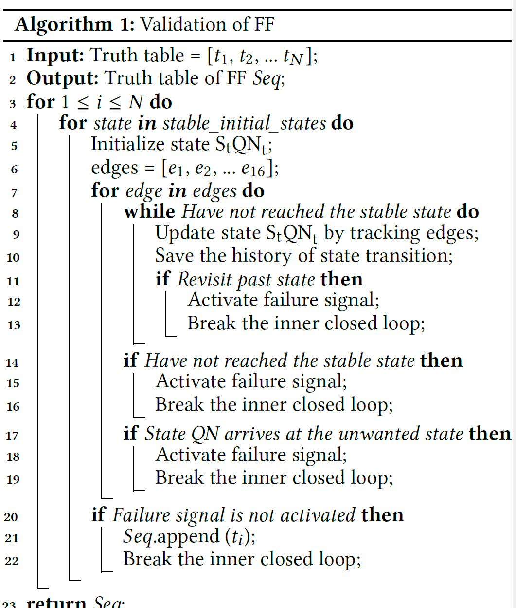

# 1. Motivation
In sequential element design,
- Current Topology of sequencial element rely on the expertise of designer.
- Could not search all available FF topologielian functions -> derive circuit topologies from each of them.

# 2. Past Method
## 2.1. Master-slave edge triggered structure 
ex. transmissing-gate FF (TGFF)
- straightforward operation, robustness

## 2.2. Dynamic power reduction  
"Q in transistor can act as internal state, so that single phase is sufficient in dynamic circuit based FF"
### 2.2.1. true single-phase clock FF (TSPC)
- reliablilty issue due to floating node inside circuit.

### 2.2.2. single-phase static contention-free FF (SC2FF)
- enhance reliability
- ineffective for resolving rebundant transition inside circuit.

### 2.2.3. change-sensing FF (CSFF)
- eliminate rebundant internal translations to achieve power reduction.
- unforeseen reliability issue

### 2.2.4. redundancy eliminated FF (REFF)
- succeeds in optimization
- setup time limitation

## 2.3. Previous Methodology
### 2.3.1. Transistor-level design
- improvement from standard library, practical
- small search space (master-slave, similar structure)

### 2.3.2. Gate-level design
- enable merging of identical node. bigger search space.
- still restricted search space in master-slave

### 2.3.3. Logic-level design : proposed method
- biggest search space 
- can discover new topology

## 2.4. Summary 
- since there is no ideal FF, it is important to select optimal FF fit to requirements.
- if we generate FF topologies as possible as many, they can cover wide range of design specifications.
- which allows select more suitable FF for specific design.

# 3. Proposed Method 
SeGen : Logic-level Sequencing element synthesis methodology

# 4. SeGen
## 4.1. Main Idea 
- First, explore all cases of truth table, then we can find numerous truth table which behaves exactly as FF
- Second, for that truth tables, two distinct truth table has exactly same transition path, output property, group them as one group.
- Third, transfer truth table into boolian expression considering race conditions
- Fourth, Find common terms and merge as possible
- Fifth, Using Implemented Transistor-level circuit, Specify all internal state property at each state 
- Finally, Eliminate redundant transistors.

## 4.2. Implementation
### 4.2.1. Validation

# 5. Experiments

# 6. Conclusion 

