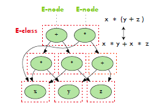
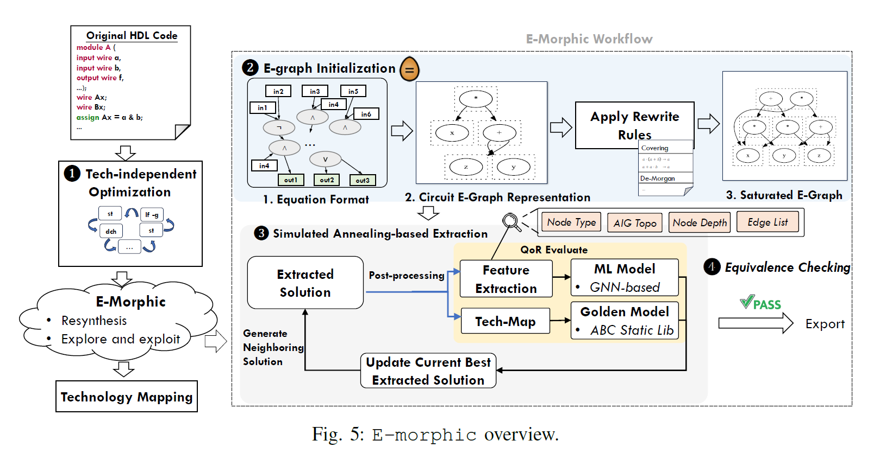
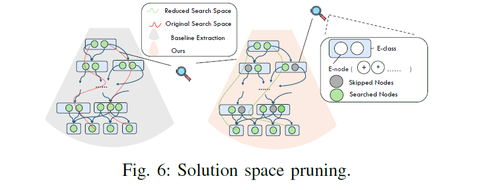
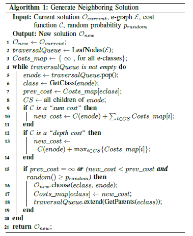
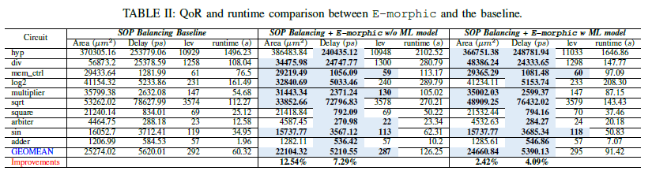
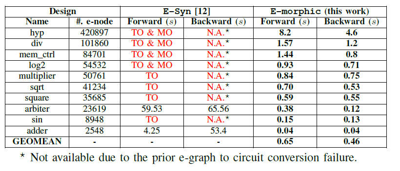

# E-morphic: Scalable Equality Saturation for Structural Exploration in Logic Synthesis

## Main problem
- In modern logic synthesis, the final circuit Quality of Result (QoR) heavily depends on the **structure produced after technology-independent optimization**.  
- If the structure is suboptimal, even perfect technology mapping cannot recover QoR.  
- Therefore, **structural exploration** is critical to unlock better implementation quality.

## Previous approach

### 1. Traditional Synthesis Flow
- Standard flow: Verilog → Logic optimization (e.g., ABC) → Technology mapping.  
- Structural changes rely on local rewrites or peephole optimizations.  
- Limited structural diversity → Prone to local optimum.

### 2. Equality Saturation (e.g., E-Syn)
- All semantically equivalent expressions are stored in an **e-graph**, rewritten until saturation.  
- Greedy extraction used for selecting final expression.  
- Major issue: poor scalability — fails on large circuits (>40K e-nodes) due to runtime and memory limits.

## Specific problem & motivation
- Fixed structure after optimization limits mapping potential.  
- Prior equality-saturation methods (like E-Syn) are not scalable to large real-world circuits.  
- **A scalable, high-quality structural exploration method is needed.**  

- 
## Proposed Methodology

### 1. Few-Iteration Structural Rewriting after Tech-Independent Optimization
- Structural exploration is performed **after technology-independent optimization** to mitigate structural bias.  
- Instead of saturating the e-graph, **only a few rewriting iterations** are applied, which already generate a large number of equivalence classes.  
- This enables **larger structural transformations** without degrading independent optimization targets such as node size or logic level.

### 2. Solution-Space Pruning for Extraction
- Each e-class can contain thousands of redundant e-nodes generated by commutative and associative rules.  
- **E-morphic prunes e-nodes with higher costs** using a traversal queue and a cost cache (`Costs_map`) during extraction.  
- Only e-nodes whose costs are less than or equal to the current minimum are explored, significantly reducing redundant search space and extraction time.

- 
### 3. Simulated Annealing-Based Extraction
- Extraction from an equality-saturated e-graph is NP-hard, and greedy selection often gets trapped in local minima.  
- **E-morphic replaces greedy extraction with simulated annealing (SA)**, combining bottom-up cost computation with probabilistic acceptance based on temperature scheduling.  
- Multi-threaded SA runs in parallel to explore diverse structural candidates, ensuring both high quality and scalability.

- 

## Experimental result

### Dataset
- EPFL combinational benchmark suite (ASAP 7nm technology library)

### Summary

| Metric | Baseline | E-morphic | Improvement |
|--------|-----------|-----------|-------------|
| Area   | 25,274    | 22,104    | 12.5% ↓     |
| Delay  | 5620 ps   | 5210 ps   | 7.3% ↓      |

- E-Syn fails (timeout or OOM) on most large circuits.  
- E-morphic succeeds on all benchmarks with consistent QoR improvement.

## Contribution
1. **Scalable equality-saturation framework**  
   - DAG-based e-graph encoding enables large-scale circuit support.  
2. **Solution-space pruning and simulated annealing for efficient extraction**  
   - Overcomes greedy extraction limitations while maintaining scalability.  
3. **ML-based cost model for efficient scoring**  
   - Enables fast structure ranking and mapping-aware decision-making.  
4. **Substantial QoR improvement through structural exploration**  
   - Achieves ~12.5% area and ~7.3% delay reduction on average.

## Expansion
- Can be extended to sequential circuits and timing-driven mapping.  
- Future work: improve ML cost-model accuracy and automatically learn rewriting rules.  
- Applicable to general logic optimization and high-level synthesis flows.  

- Demonstrates that pruning effectively mitigates complexity growth in equality-saturation frameworks.

## Insight 
- Search space 의 폭발적 증가를 partial evaluation + pruning 으로서 해결한 점.
- Gate level 이지만, GNN/ABC mapping 을 이용해 feature extraction/prediction 시도한 점.