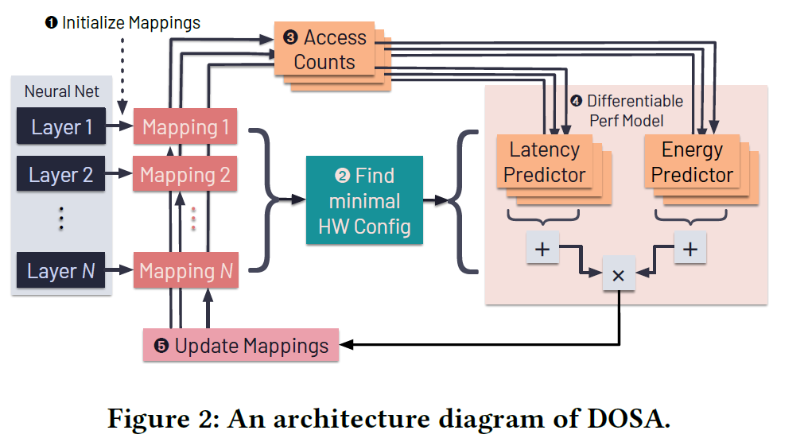
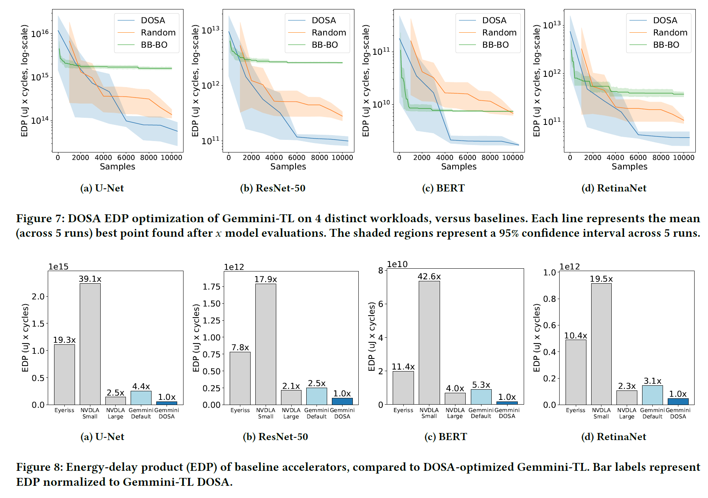
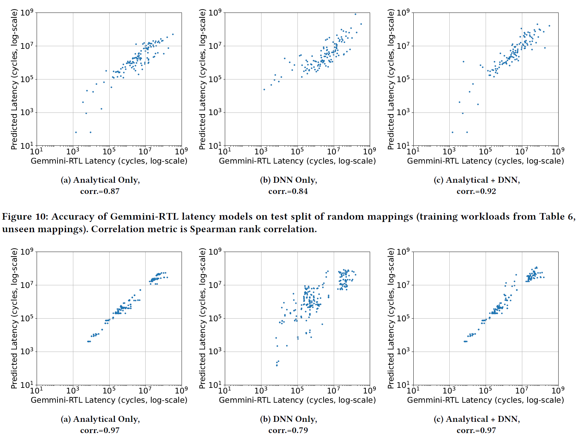

# TL;DR
## Mapping-first, Analytical model based Gradient discent ANN accelerator DSE within Gemmini architecture.

---

## 1. Problem Context

### 1.1 Main Problem
DNN accelerator DSE

### 1.2 Previous Approaches and Their Limitations
#### In terms of optimization strategy, 
- Accelerator composed of architecture space(systolic array size, buffer size, ... ) and mapping space(loop order, tiling, partitioning, parallelization, time multiplexing)
- Most of research explore only one of them / or used two-loop approach (HW-first) 

#### In terms of optimization method,
- Black box : genetic algorithms (BB-GA), reinforcement learning (RL), Bayesian optimization (BB-BO), Linear Combination Swarm (BB-LCS), and evolutionary strategy (BB-ES).
- White box : linear programming (LP) and mixed-integer programming (MIP) can be used if the relationship can be expressed in specific frameworks. Gradient descent (GD) techniques can be applied if the relationship can be expressed in a differentiable expression.
- Heuristics 

=> Mapping first (with HW template) => Minimal HW parametrization => differentible analytical power model-based Gradient discent optimization. => update mapping

## 2. Methodology: Optimization strategy

### 2.1 Core Idea : Mapping-first search
- most of architectural spec can be derived from mapping. (PE number, buffer size)

### 2.2 How and Why It Works
- especially minimum buffer capacity can be analytically calculated from mapping. It eliminate architecutre space, we can only consider mapping space.

### 2.3 Implementation Details (When Necessary)

## 3. Methodology: Optimization methodology

### 3.1 Core Idea : Analytical model for required HW + Power/latency model
1. Required HW specification : minimum PE number, minimum buffer size
2. Power model : action count * analytical model for each storage layer 
3. latency model : maximum of compute delay and memory delay 
is built, and utilized in optimization process.

**Details can be referenced by original paper**

### 3.2 How and Why It Works

## 4. Results and Discussion

### 4.1 Experimental Setup

### 4.2 Key Results

#### Optimization result 

#### Analytical model(+ML based refinement) - Gemmini-RTL metrics relation.

### 4.3 Conclusions and Implications

## 5. My Perspective (Optional)
### Related to DSE strategy 
- Is it possible to determine architecture specification from just mapping? (CRITICAL)
-> This problem is extremely simplified, because in this case, most of architecture is aleady fixed(where, which matrix to store). and small degree of freedom (capacity of each stroage, number of PEs) is determined from mapping.
-> This specific assumption also restrict mapping space, because arch<->mapping efficiency has strong relation.

### Related to DSE methodology 
- analytical model is just replication of Timeloop analytical model, eliminating nonlinear factor (ceiling function)? 

