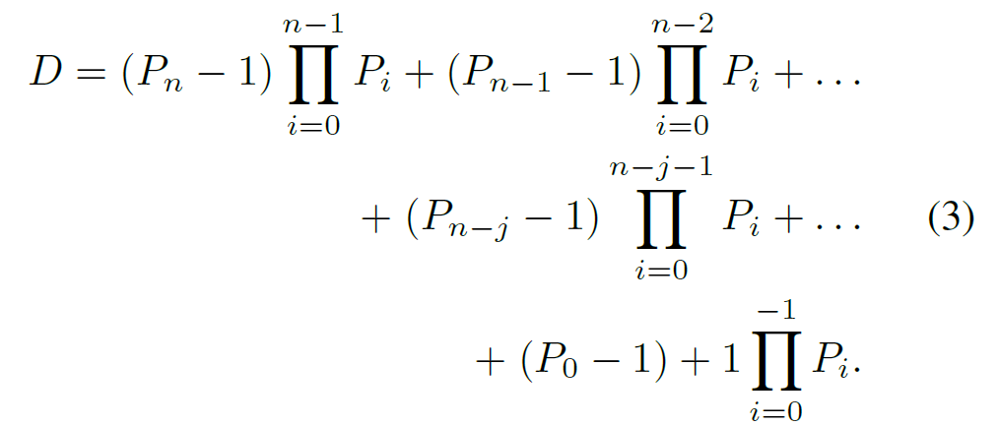
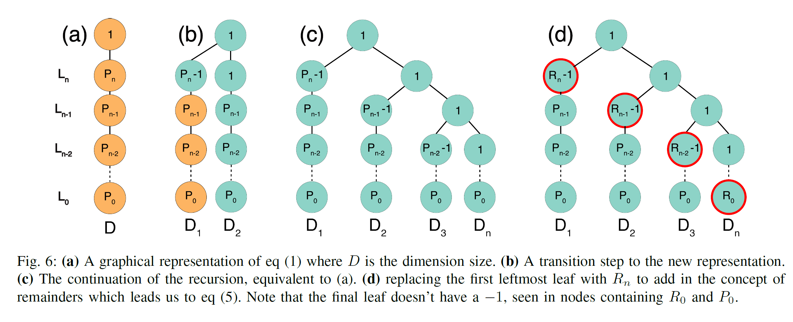

# TL;DR
Extending design space from Perfect factorization => Imperfect factorization space  mapping space, find more optimal solution space.

---

## 1. Problem Context

### 1.1 Main Problem
Dataflow-centric accelerator design space (mapping space) exploration

### 1.2 Previous Approaches and Their Limitations
Limited in perfect factorization (underutilize PEs)

## 2. Broader Mapspace

### 2.1 Core Idea
- Super simple idea. Perfect factorization mapper (PFM) result in underutilization
=> Broaden design space to imperfect factorization mapping, result in better utilization. 
=> however, it makes brute-force untractable.
- Imperfect factorization can be represented as tree-like structure and following equation.

### 2.2 How and Why It Works
- In spatally parallel hardware, it is better to use maximum number of PE, but there is no ensurance number of PE is factor of tile size.
- So, global optimum mapping coule be outside of perfect factorization, which motivates expand of mapspace to imperfect factorization.

### 2.3 Implementation Details (When Necessary)

## 3. Efficient exploration

### 3.1 Core Idea
- Baseline : PFM (perfect factorization mapper) : stochastic search algorithm(random sampling)
- Proposed : Ruby (random), Ruby-S (spatial dimension imperfect), Ruby-T (temporal dimension imperfect)
- Ruby-S => for utilization, Ruby-T => for power(by improving reuse)

### 3.2 How and Why It Works

### 3.3 Implementation Details (When Necessary)

## 3. Results and Discussion

### 3.1 Experimental Setup

### 3.2 Key Results

### 3.3 Conclusions and Implications

## 4. My Perspective (Optional)
