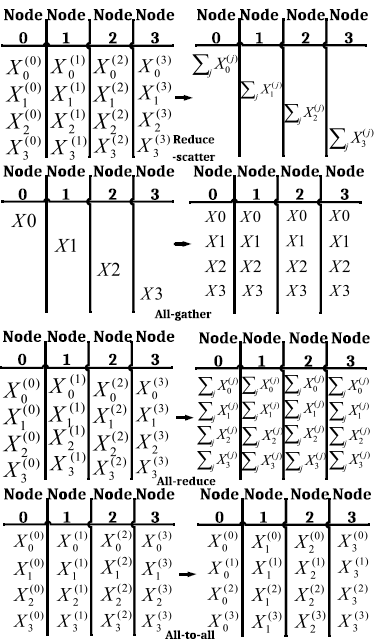

---

title:
"ASTRA-SIM: Enabling SW/HW Co-Design Exploration for Distributed DL Training Platforms"
"ASTRA-sim2.0: Modeling Hierarchical Networks and Disaggregated Systems for Large-model Training at Scale"
ref: ISPASS 2023
date : 2026-05-22
PI : Tushar Kishna
level: "Review"
status: "Draft"
---

# 1. Motivation
Simulation of future computing platforms

# 2. Past Method 

## 2.1. Problem 
Reliably abstract modern computing systems, and accurately sumulate training of DNN.

# 3. Proposed Method 

## 3.1. Design Space Challenges
### Parallelization mechanism
MP : activation and input gradient interact
DP : weight gradient should interact
### Collective communication mechanism
interact : reduce-scatter, all-gather, all-reduce, all-to-all
=> to make it efficient, **multi phase collectives** used.

### Communication scheduling 
first layer gradient is hard to hide, so it is important.
### Topology 
Torus, AlltoAll 

## 3.2. ASTRA-Sim
- topology-aware collective operations, and different parallelism approach for training
### Workload layer 
- Compute time(**calculating compute time is orthogonal to astrasim**)
- Parallelism approach, layer orders
- Required communication

### System layer
- topology
: system layer is responsible for getting workload and based on topology, effectively schedule network event. (Translate communication workload into real network traffic)

### Network layer (Garnet)

# 4. Implementation

# 5. Experiment

ablations providing topology insights.

# 6. Conclusion
- 

# 7. My perspective 
- Why real-world validation is not performed in evaluation? This paper simulates multi-node and their topology-aware collective communication, however, its validness is not yet clear. => this is partially validated in astrasim2

- This paper supports general parallelism strategy, topologies, however, in real world deployment, most of application uses only DP for inter-node and TP or PP for intra-node. Is this design space is effectively large?
