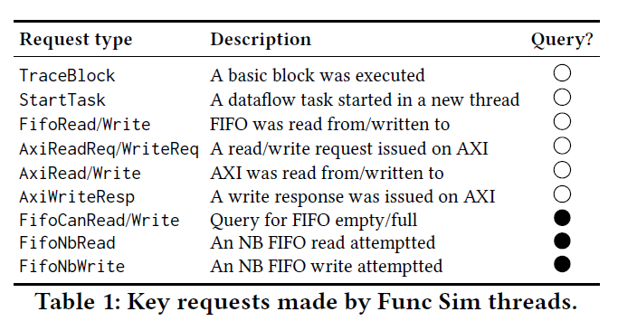
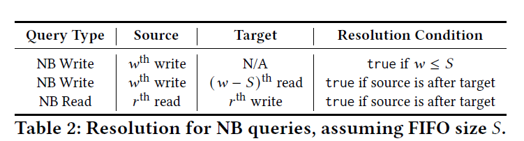

# 1. Motivation
performance simulation for HLS

# 2. Past Method 

## 2.1. Problem 
Lack of hardware details(non-blocking fifo, branching, loop count) makes it difficult to 
1. ensure functionality 
2. estimate performance 

key observation : Performance and Functionality is tightly coupled.

# 3. Proposed Method 
## 3.1. Taxonomy 
objective : ensure functional correctenss, accurate estimation of performance

### Type A - Easy to simulate
**Concurrency- and cycle- independent**
1. non-dataflow or use only blocking FIFO accesses
2. modules have acyclic dependencies
- example : systolic array, convolution engine, DSP.
=> just use single-thread sequential computation for funct/perf simulation

### Type B - Hard for performance simulation
**Concurrency-dependent and cycle-independent**
Use either of 
1. non-blocking FIFO accesses
2. infinite loops(Cyclic dependency)
However, non-bloecking access pattern does not alter program behavior (data-dependent branching)
- example : instruction-controller relation, DMA, ..

### Type C - Hard for both simulation 
**Concurrency- and cycle-dependent**

Type B, but varies program behavior based on data.
- example : Out of order execution, adaptive packet router 

# 4. Implementation
Omnisim implements C-level simulation with 
1. Centralized-performance simulation thread 
2. multi threaded functionality simulation threads

## 4.1. Lighteningsim
Phase1. Trace and simulation graph generation
uses LLVM IR & Static scheduling, generates trace of executed basic blocks, and dynamic stages. =>(event list, simulation graph)

Phase2. Trace analysis(stall analysis)
Incorporate hw information for cycle level performance analyisis, reflect hw-information, resolve unresolved simulation graph dependency => (cycle level performance)

## 4.2. Omnisim 
1. Each functional thread starts functional simulation. 
2. If some functional thread reaches NB FIFO write, query to performance thread 
3. performance thread maintains FIFO read/write table, and answer the query.
4. functional thread resume simulation 

invoke all threads => func thread simulate each module/submodule, while performance thread process requests => when all func threads are paused, perf thread try to resolve it => repeat

### 4.2.1. Optimizations
#### Deadlock detection 
#### Incremental simulation (FIFO depth dse)
#### Runtime optimization : graph structure, eliminating redundant fifo check (llvm pass)

# 5. Experiment
fast, cycle-accurate, handling type B/C

# 6. Conclusion
- Adressing gap between C-level abstractions and Hardware-level semantics. 

# 7. My perspective 
Although the paper is implementation-heavy, its contribution is compelling because it extends C-level HLS simulation beyond the capabilities of commercial tools, especially for complex dataflow designs with non-blocking FIFO accesses and cyclic dependencies.
