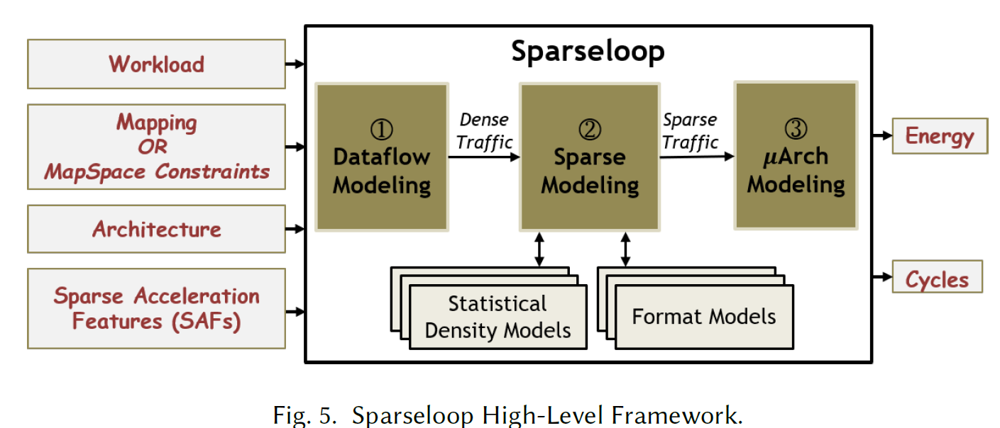

# TL;DR
## Generalizing sparse-aware accelerator techniques and integrate it into simulation flow, building Flexible, Fast, Accurate simulator for Tensor accelerators.

---

## 1. Problem Context

### 1.1 Main Problem
Efficient sparsity-aware accelerator design for tensor multiplication

### 1.2 Previous Approaches and Their Limitations
- Diverse accelerator tried to exploit ineffectual computation, and employ diverse options of dataflow, memory hierchy, computation semantics. 
- However, theirs accelerator is just one specific options in diverse, infinite design space, It lacks to efficiently and systemically find optimal accelerator design in short time.
- Simulator matters, and it requires **Flexibility**, **Accurate**, **Fast**.

#### 1.2.1. Flexibility 
Eyeriss, SCNN, ExTensor, DSTC each applies different sparse-aware accelerator technics, and it is important to systemically generalize their accelerators into larger design choices.

- **Sparsity representation** 
- - 1. Bitmask : speed unchanged, energy decrease, efficient at high density (80%~)
- - 2. Coordinate list : speed faster, energy decrease, efficient at lower density (0~8%) 

## 2. Classification of various sparsity idea 

### 2.1 Core Idea

#### 2.1.1. Sparsity idea classification (SAF : sparse acceleration feature)
Sparsity idea can be divided into 3 information.
1. Representation format : U, B, CP, RLE, UOP hierarchical representation. ex. CP-CP
2. Gating (operation/memory) : Let IDLE ineffective computation/access (time unchanged, power decreased)
3. Skipping (operation/memory) : Skip ineffective computation/access (time decreased, power decreased), but requires complex hardware to efficiently decode next index/address to jump on 

#### 2.1.2. Dataflow idea classification
Dataflow is orthogonal to SAF, but some dataflow will match with some SAFs well, efficient implementation.

=> In conclusion, specific sparse-aware architecture can be represented as 
1. Representation format for each I, W, O 
2. Utilized Gating/Skipping techniques and its direction ex. (I->W), (I&W->O)
3. Dataflow-related information (order of dimension, partitioning, parallelization)

### 2.2 How and Why It Works
- Representation type is independent in different dimension. So, cartesian product can describe design space 
- Skipping / Gating can be realized using additional HW. And their effect to action count is different.
- - But, Representation type - Skipping/Gating. isn't there dependency? For example in Dense I, Bitmask W situation, skipping/gating I->W is infeasible. 

### 2.3 Implementation Details (When Necessary)

## 3. Analytical method to simulate (SparseLoop)
Main difficulty 
1. There is exponential SAFs/mappings/architectures options with Problem options, Framework should cover these combinations without specialized implementation 
2. To make DSE practical, simulation time should be fast. => do not use real data (approximate)

### 3.1 Core Idea

3 Consecutive step to simulate. 
1. Dataflow modeling 
- Assume Dense matrix, format, obtain action count based on **TimeLoop**

2. Sparse modeling
- Based on statistics of tensor, calculate stocastically effect of SAFs and format.

3. Microarchitecture modeling 
- Determine validity of mapping(capacity condition, dependency condition ...) and predict Power, Area based on traffic count (Accelerergy)

### 3.2 How and Why It Works

### 3.3 Implementation Details (When Necessary)

## 4. Results and Discussion

### 4.1 Experimental Setup

### 4.2 Key Results

### 4.3 Conclusions and Implications

## 5. My Perspective (Optional)
