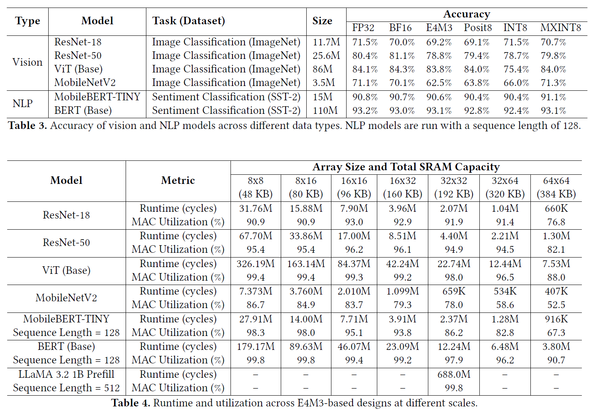

# TL;DR

# 1. Motivation
DNN accelerator design is time-consuming task.
Many of RTL generators has limitation.
1. They are not capable of design space exploration
2. Current generation framework limits its design scope into small region, or support small options(quantization, parametrizaation)
3. End-to-end framework (especially, software/compiler stack) is often weak.

# 2. Past Method 
## Simulator 
Interstellar, Timeloop, Maestro, Zigzag

## RTL generator 
Tandem Processor, DNNBuilder, MARRI, NVDLA, MAGNET, Gemmini

# 3. Proposed Method 
## 3.1. Hardware structure
Matrix unit handles GeMM (weight stationary + systolic array)
Vector unit handles activations 

## 3.2. Extensive parametrization 
- resource allocation (compute/memory scale)
- resource type (datatype, quantizations)
- scheduling (loop transformations)

# 4. Implementation
- details (pre-computation of constants, flattened loop control)

# 5. Experiment

# 6. Conclusion
End-to-end framework for generating DNN accelerators enables fast(not scalable but faster) design space exploration for diverse architeture configurations. 

# 7. My perspective 
