---
title: "TrueNorth: Design and Tool Flow of a 65 mW 1 Million Neuron Programmable Neurosynaptic Chip"
ref: TCAD 2015
date : 2025-12-18
authors : Filipp Akopyan et al
level: "Review"
status: "Draft"
---

# TL;DR

## Utilizing SNN's asynchronous nature, architecture / circuit / manufacture level departure from conventional von-Neumman architecture.

---

## 1. Problem Context

### 1.1 Main Problem

Cognitive and perceptual tasks demand large-scale data processing with low latency, which results in prohibitive energy consumption when implemented on conventional von Neumann architectures.

The human brain, however, achieves remarkable energy efficiency by operating at a low average neuronal firing rate (~10 Hz) and modest power consumption (~20 W), while still supporting complex perceptual and cognitive functions through massive parallelism, tight coupling of computation and memory, and event-driven communication.

In contrast, conventional architectures rely on global clock synchronization and centralized memory, leading to communication-dominated energy costs and limited scalability. This fundamental architectural gap motivates the development of brain-inspired computing paradigms that depart from traditional synchronous von Neumann designs.

### 1.2 Previous Approaches and Their Limitations

#### 1.2.1 SpiNNaker : Fully digital, microprocessor-based SNN simulation, high system power (25–36 W)
#### 1.2.2 Neurogrid : Mixed analog–digital, shared parameters & limited per-neuron configurability, system-level power (3.1W)
#### 1.2.3 BrainScaleS : Mixed analog–digital, wafer-scale, focuses on accelerated (1000–10,000× real-time) throughput rather than real-time or power efficiency

TrueNorth targets power minimization by adopting an event-driven, asynchronous execution model with a strict one-to-one correspondence between hardware and software representations.

## 2. TrueNorth : Neuromorphic core

### 2.1 Core Idea

#### 2.1.1 Abstraction of real human brain into circuit. 

Human brain is consists of neuron and synapse. and firing signal is passed from neuron -> axons -> (synapse) -> dendrite 

neurons have information about membrane potential(current value), threshold(comparison constant) and synapse has connection strength(weight). They are all stored in SRAM.

Chip consists of 4096 Cores, each core represent 256 logical neurons. 

##### Trade-offs 
- If # core increase, become smaller: 
higher interconenect overhead. Lower dynamic power 1due to lower activity rate. (if interconnect power increase, could reversed). SRAM required storage decrease(but routing table increase due to inter-core complexity), because w_ij total space decrease. Latency increase.

#### 2.1.2. Basic computation of neuron, Weight-adaptive quantization of ANN 

If we use all exact weight in SNN, result in big storage. So SNN only use 4 integer weight per each neuron, stored in SNN core.

so if we consider neuron i -> neuron j directed path, neuron i is quantized to (Type 1~4), and for each type, neuron j has weight internally, computation is processed in neuron j.

Computation is simple, but additional technical improvement is adapted (ex. stochastic spike integration, leak, and threshold using a pseudo random number generator (PRNG))
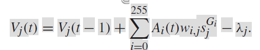

#### 2.1.3. Asynchronous inter-core design, Synchronous intra-core design.

Inside the core, required operation is integer accumulation, comparison. and these operation can be implemented using synchronous Logic, minimizing transistor count and static power.

However, outside of core, if we use global synchronization clock, It will waste power itself and toggle unnecessory flip-flops. 

In specific domain (SNN inference), it is near-ideal situation to utilize event-driven design because, entire system can be detached into smaller independent module "neuron", we can use low-frequency tick to ensure completion of inference and prevent data hazard.

#### 2.1.4. Per module Detailed explanation
- Chip, Neurosynaptic core grid composed 64*64 Neurosynaptic core, each core composed of Core SRAM(Store weight, membrane potential, execution mode, debugging info etc..), Scheduler(Scheduling input spikes, wait for ticks), Token controller(to utilize time multiplexing pass one-by-one token, and generate synchronous Clock to use in Neuron block), Neuron block(Core computation(accumulation, comparison with stochastic/deterministic mode) for 256 neurons) 
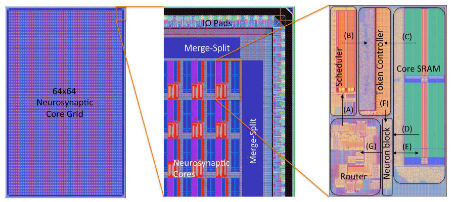

##### A. Neuron Block 
- Neuron block is basically synchronous circuit, which conducts per neuron operation. To simplify hardware, it truenorth utilize per-neuron, per-axion time division multiplexing, repeating simple operation, finally calculate accurate value. 
- Neuron Block is controlled by token controller, token controller generate intra-core clock signal and pass axons one-by-one.
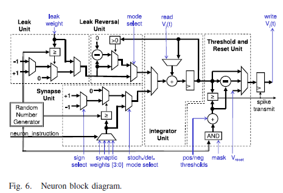

##### B. Router 
- Router handles spiking data(firing signal from neuron), pass to the destination axons. Router make 64 * 64 2D mesh, connected with adjacant 4 router. Compiler matters, because EPC compiler should minimize hop count (manhatten distance) to minimize power consumption, delay. This optimization problem is solved heuristically in this paper, but **AI-driven method** can be applied.
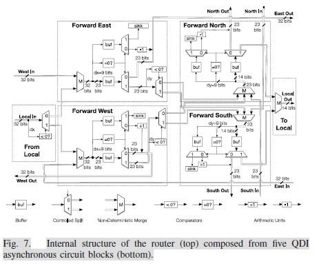
- 
    | Field | Bit Index | Bit Names |
    |------|-----------|-----------|
    | dx (9b, signed) | [31:23] | s, b8, b7, b6, b5, b4, b3, b2, b1 |
    | dy (9b, signed) | [22:14] | s, b8, b7, b6, b5, b4, b3, b2, b1 |
    | debug (2b) | [13:12] | d1, d0 |
    | destination axon (8b) | [11:4] | a7, a6, a5, a4, a3, a2, a1, a0 |
    | delivery tick (4b) | [3:0] | t3, t2, t1, t0 |

- Passed horizontally first, then vertically, preventing deadlock, and since this undeterminism, spikes that occured in same tick may arrive destination axons in different tick. To resolve this, use delivery tick, make strict deadline and wait for that deadline.

##### C. Scheduler
- Scheduler gets spike packet (32bit, 14bit without dx,dy) and store it into schedular SRAM. 
- **Scheduler SRAM(12T bitcell)** should hold special functionality, it receive only 1 bit WRITE from router(after decoding where, when to fire), 256bit READ/CLEAR signal from token controler. Because consumer of temporaily stored data is token controler(it pass that information one-by-one to neuron block).
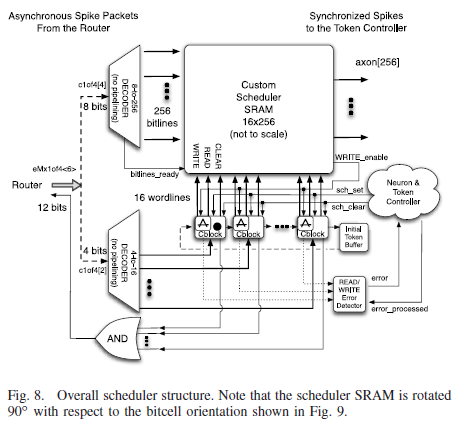
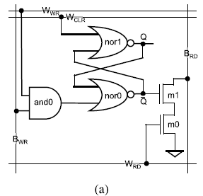

##### D. Core SRAM
- 256 row * 410 column SRAM(6T bitcell). 256 column for synaptic connection, 124 bits for neuron parameters, 26 bits for spike destination, 4bit for delivery tick.
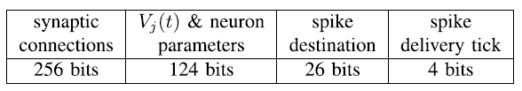
-
    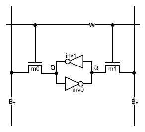

##### E. Token Controller
- Token controller is responsible for ochestration of spike information between scheduler and neuron block. It generates clock signal used in neuron block, and pass the internal SRAM data with Core SRAM data(after read it).
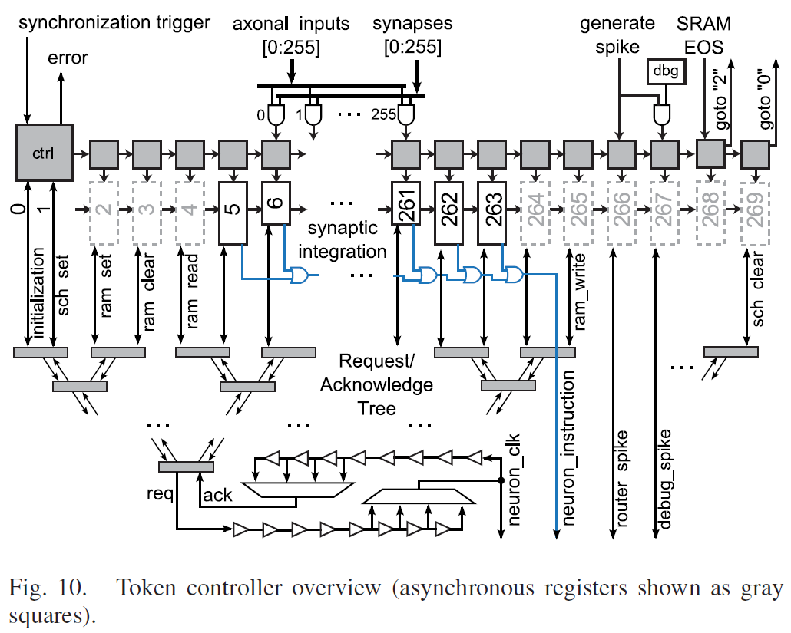
- At maximum, for 256 neuron, for 256(not all) axons, neuron membrane potential is updated using weight and synapse connection information in core SRAM. If tick is too fast, Spike dropping might occur, but it is not critical problem in this context. 
- Token controller serves as boundary of synchronous and asynchronous domain.

##### F. Periphery : Merge-split block and serialize/deserialization & Scan chain for debugging
- Used time-multiplexing for inter-chip (multichip) integration. because wire count is restricted, it is inevitable.
- Scan chain has implemented with technical improvements.

### 2.2 Implementation Details (When Necessary)

## 3. TrueNorth : Design methodology 

### 3.1. Core Idea

#### 3.1.1. Entire flow
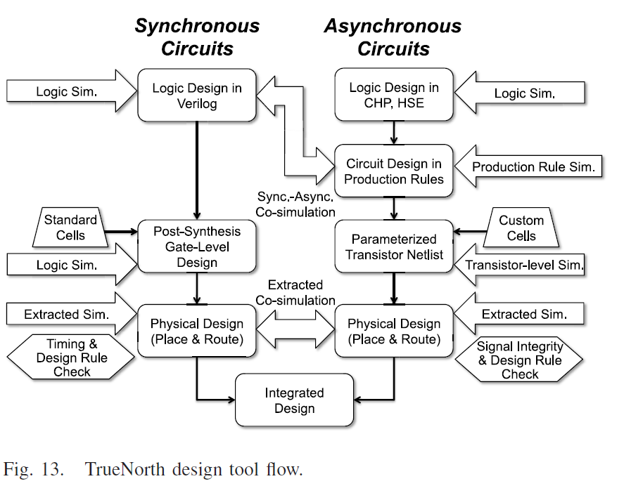
- Custom tools like COSIM, Academic tool PRSIM used for asynchronous-synchronous integration, Standard flow used synchronous circuit. But, it might be very hard to reproduce this environment.

- Synchronous-Asynchronous interface for all cases make possible timing analysis for neurosynaptic core.

- Also manufacturing process was tuned to low-power, improve yield.

#### 3.1.2. Spike packing optimization
- active power consumption proportional to manhatten distnace.

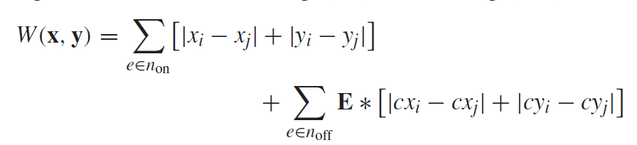
- off chip spike packet bandwidth is much lower than on chip bandwidth. (~640times)

- This wirelength(objective fucntion) is minimized through CPLACE.

- Best case from 4 algorithm. Multilevel Partitioning-Driven Algorithm, Analytical Constraint Generation Algorithm, Hierarchical Quadratic Placement Algorithm, Quadric-Based Force-Directed Analytical Algorithm

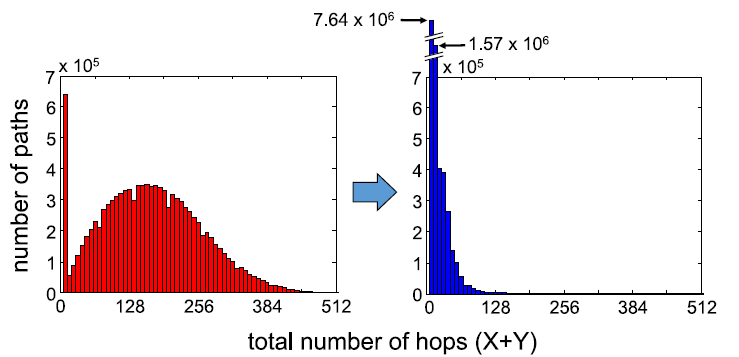
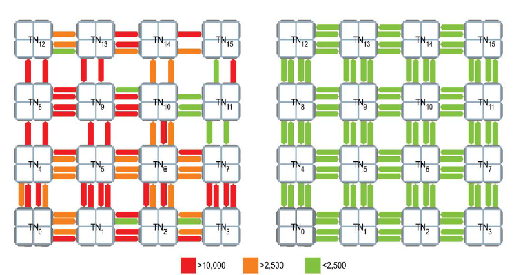

### 3.2. Implementation Details (When Necessary)

## 4. Results and Discussion

### 4.1 Experimental Setup
#### 4.1.1. HW setup 
TrueNorth chip

#### 4.1.2. SW setup
Applications, (Haar-like Features, Local Binary Patterns, Saccade Generator, Grid classifier...)

### 4.2 Key Results
- **Extremely Low Power**

- Real-time performance
All demonstrated streaming video applications run at 30 frames per second, satisfying real-time constraints.

- Scalability via spatial replication
Object detection accuracy scales with the number of TrueNorth chips used:
    Grid Classifier A: lower chip count, reduced energy/area, slightly lower accuracy
    Grid Classifier B: higher chip count, improved precision and recall

- Energy-efficient inference
Classification and attention-related tasks are executed with significantly lower power consumption compared to conventional CPU/GPU-based implementations, highlighting the benefit of event-driven execution.

- End-to-end system feasibility
Demonstrates that complex perception pipelines (feature extraction → attention → classification), when partitioned appropriately between CPU and neuromorphic hardware, can operate reliably in real-time.

### 4.3 Conclusions and Implications
- Conventional von Neumann architectures are fundamentally optimized for floating-point and integer operations, prioritizing hardware versatility. However, the strict separation between memory and computation, combined with fully synchronous design, leads to excessive flip-flop activity and internal node switching—even when no useful computation is performed. This results in substantial unnecessary dynamic power consumption at the system level.

- TrueNorth fundamentally addresses this inefficiency by rethinking the architectural assumptions in the context of a specific application domain: spiking neural network (SNN) inference. SNNs are composed of millions of structurally identical units—neurons—whose operation is naturally event-driven. By implementing neurons and neurosynaptic cores using quasi delay-insensitive (QDI) asynchronous circuits, TrueNorth aligns the hardware execution model directly with the computational semantics of SNNs.

- This architectural choice enables large-scale integration of massively replicated asynchronous circuits on a single chip while maintaining correctness and robustness. As a result, most circuit elements remain idle unless meaningful spike events occur, dramatically suppressing active power consumption. TrueNorth thus realizes an entire SNN in hardware with ultra-low power operation, achieving levels of energy efficiency unattainable with conventional synchronous designs.

- Importantly, this architectural philosophy is not narrowly specialized or fragile. The design principles—event-driven execution, asynchronous communication, and massive parallel replication—are scalable and extensible. They suggest a viable path toward brain-scale neuromorphic systems operating within kilowatt-level power budgets, demonstrating that application-aware architectural co-design can overcome the fundamental energy limitations of traditional computing paradigms.

## 5. My Perspective (Optional)

