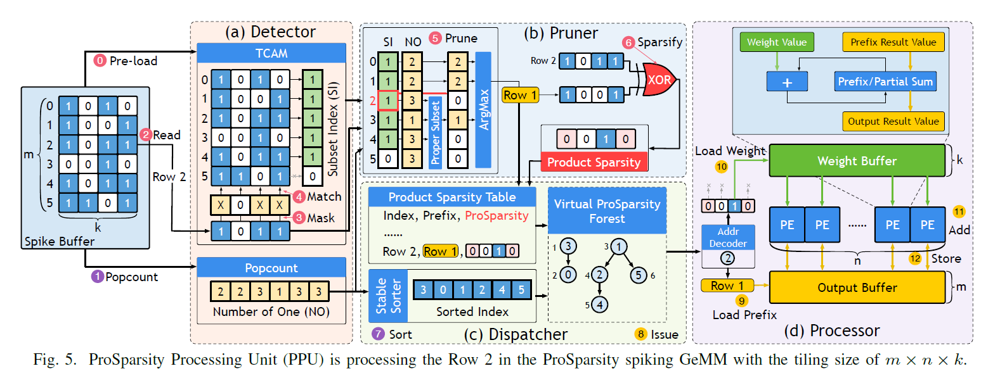
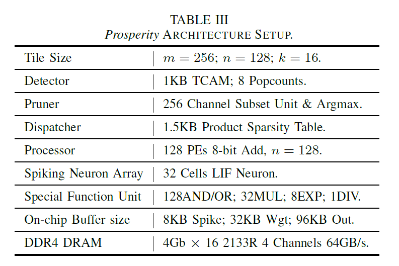
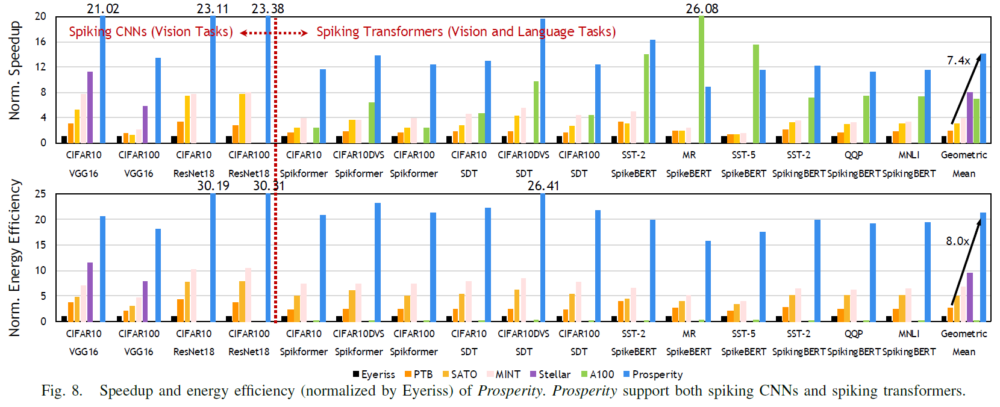

# TL;DR

Utilizing product sparsity(reuseable nature of axon accumulation) of SNN, Optimized hardware with algorithm-aware method, result in significantly improved power, latency, area when inference spiking CNN / spiking transformers.

---

## 1. Problem Context

### 1.1 Main Problem
- Bit sparsity (when input spike = 1 => accumulate, if not, skip) is widely used in SNN accelerator.

- However, Product sparsity (if bitwise bigger input spike combination should computed, it can utilize previous result). But, product sparsity is hard to observe in (M X I) matrix, so we need efficient hardware architecture to detect and utilize that property.

### 1.2 Previous Approaches and Their Limitations
- Utilizing bit sparsity (PTB(HPCA2022), Stellar(HPCA2024))
- requires structed sparsity, cannot leverage product sparsity 

## 2. Methodology

### 2.1 Core Idea

#### 2.1.1. Spiking GeMM & Product sparsity
- Almost of computation in SNN(including spiking CNNs, spiking transformers), is Spiking GeMM(General Matrix Multiplication) Input : (M * I), Weight : (I * O), Output: (M * O)
- in simple SNN, M is number of timestep T, and in spiking transformer, input is form of sequence, M is T * L (timestep * sequence length)

- And, we can find intersection between two input axon activation rows in O(m^2), and can represent it with directed graph which edge is from Prefix to Suffix.
- Additionally, if we reduce edge in each destination(suffix) in the way that only remaining biggest prefix case. Then it becomes Forest(set of unconnected trees)

#### 2.1.2. Prosperity architecture
- Composed of ProSparsity processing unit (PPU), Spiking Neuron Array, Special function unit (SFU)

##### A. Spiking GeMM tiling
- input spike submatrix (m * i), weight submatrix (i * o), output submatrix (m * o). Output buffer collects submatrix of output, accumulate to generate complete output.
- There is trade-off bigger m, i makes more sparse network using product sparsity, but requires more bigger design.(causing excessive area, energy)
- 1 spiking GeMM => (for m timestep, i axons -> o dendrite), To complete 1 spiking GeMM, processing unit do (for 1 timestep, i axons -> o dendrite) calculation, inside that computation PE handles (for 1 timestep, i axons -> 1 dendrite).
- Product Sparsity is considered in PPU level, becauses it requires history 

##### B. ProSparsity processing unit (PPU)
- **Prospersity Detector & Pruner**
from the spike buffer, get m * i matrices, first we need to do is find all pairs, that is prefix-suffix relation. O(m^2)
however, it is not preactical to implement this, using TCAM(ternary content addressible memory) to make time complexity O(m)

1. Pre-load m*i spike data in TCAM
2. Row-by-row filtering to find prefix for current row
3. Using popcount, find unique prefix using Heuristic condition
4. XOR operation to calculate bitwise differee to schedule calculation order and which bit to calculate

- **Dispatcher**
It internally stores sparsity table(virtual forest). It is responsible for really dispatching processor(computing unit) and generating execution order.

There is technical difficulty to generate computation order in runtime, because we don't have child node list(because of memory issue). So, we use some trick!: Stable sorting based on popcount of each row using bitonic sorter(O(log2(n) ^ 2)) Becasue it is ensured that suffix popcount is bigger or equal with prefix, we can just sorting all rows based on popcount, simply and efficiently generating the computation order.

- **Processor**
Using task data passed from dispatcher, perform sparse computation using PE array. 

### 2.2 How and Why It Works

### 2.3 Implementation Details (When Necessary)

## 3. Results and Discussion

### 3.1 Experimental Setup
#### HW

### 3.2 Key Results

### 3.3 Conclusions and Implications

## 4. My Perspective (Optional)
1. There is no mention about multi-PPU, but when we inference spike transformer, requires millions of spike GeMM, then how to really pass and store the intermediate data? 

2. Dual-side pruning (pruning of weight will reduce neuron activation further.)
