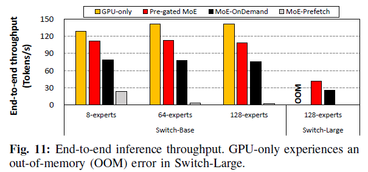
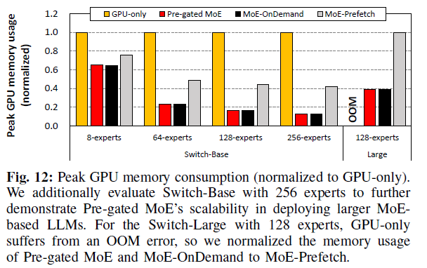
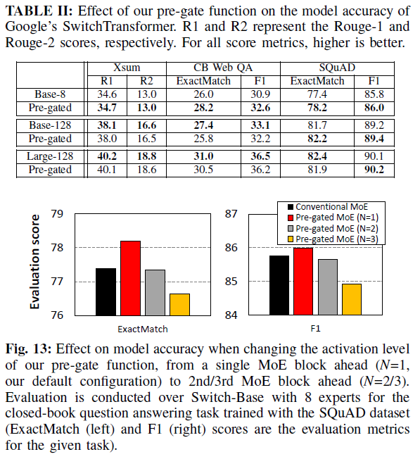
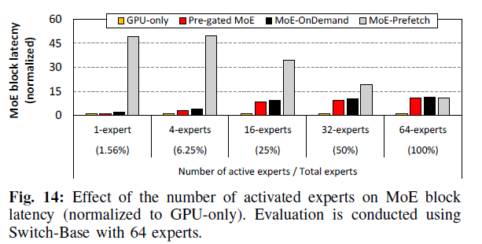
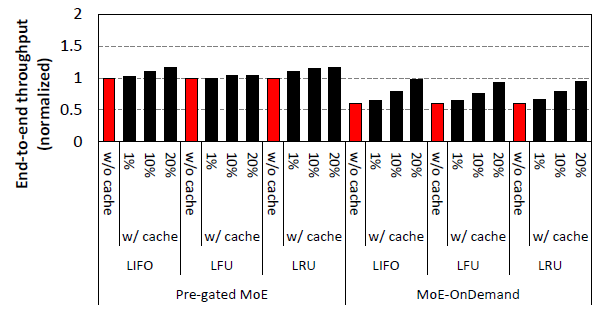

# 1. Motivation
MoE LLM serving challenges : CPU expert parameter offloading causes significant performance bottleneck

* Background 
- Sparsity of MoE: in MoE, multiple experts(FFN weights) co-exists, and through gate, each token determines which expert to activate. so the sparsity of MoE does not refer sparsity in GeMM kernel, it is more about layer-level.
- In large scale, expert-level parallelism become effective, 
- however, in restricted environment like single-GPU inference, GPU-CPU expert weight transfer significantly degrades overall performance.

# 2. Past Method 

## 2.1. Problem 
In MoE inference in small-scale environments, expert FFN weight offloading technieques matters. 

## 2.2. Remaining Problem 
- On-demand suffers from degraded performance (due to CPU-GPU overhead)
- Prefetch-all suffers from redundent memory transfer and transfer time

# 3. Proposed Method 
- Algorithm : pre-gating. 
: Determines gating one layer earlier, so that secures experts to transfer to GPU.
- System : compute-bounded execution
: thanks to pre-gating, it is possible to overlap execution and transfer of expert.

# 4. Implementation

# 5. Experiment

- improved performance respect to on-demand offloading, 
- reduced peak memory utilzation respect to GPU-only.
- performance degradation did not observed.

## 5.1. Ablation
- different N effect

- caching expert effect 

# 6. Conclusion

# 7. My perspective 
- Problem domain is limited. (there aleady exists better option "expert-level parallelsm" in large scale.) Assuming if there is sufficient number of token and gating function is not biased, load imbalance will not be significant.
- Is this scalable? in large-scale realistic deployment environment, offloading might not be an optimal solution. It is scalable in terms of single-GPU model deployment, but not scalable in terms of deployment scale.

