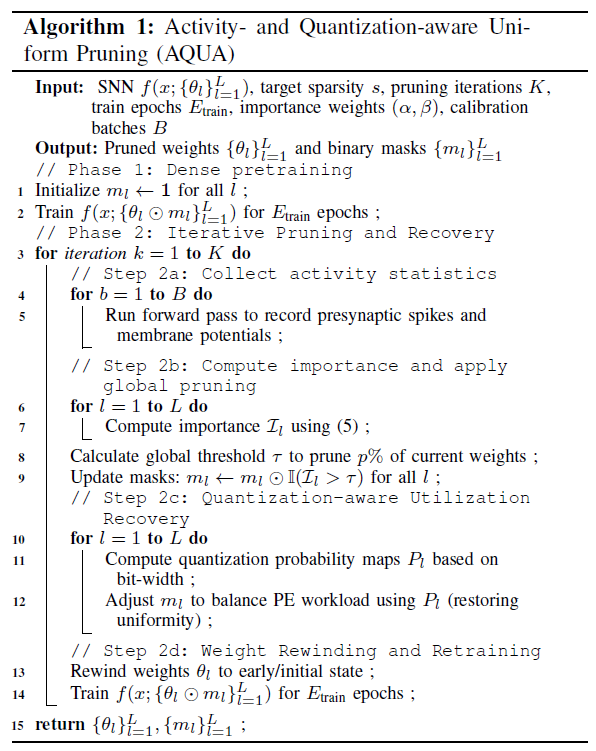
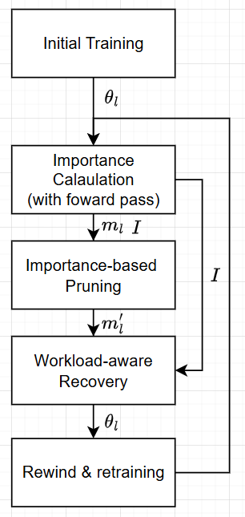
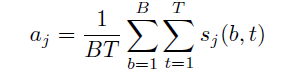
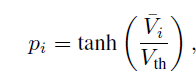
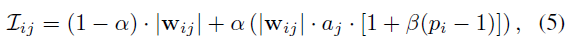
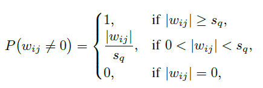
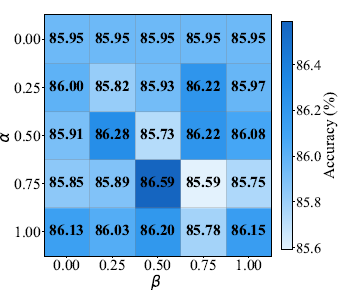
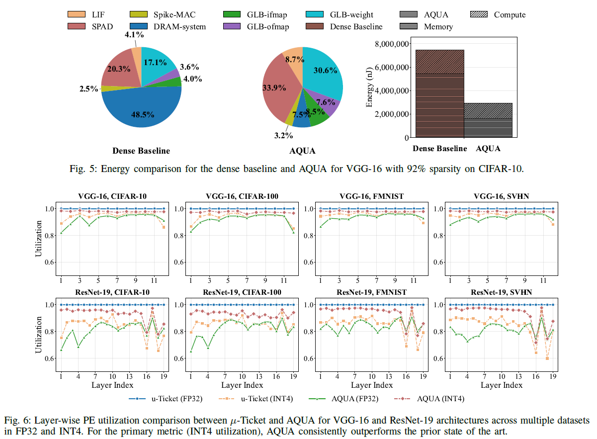
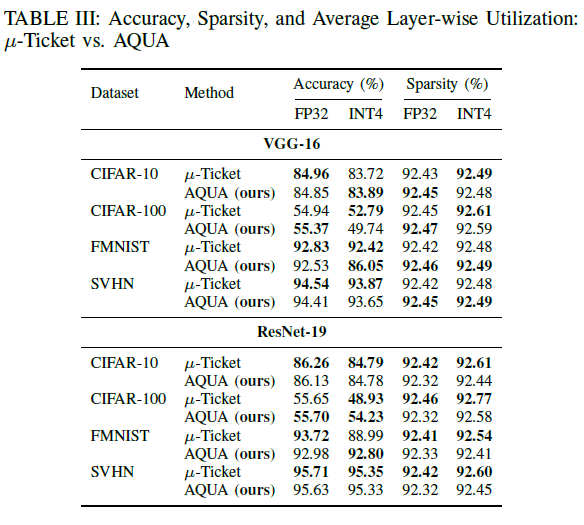

# TL;DR

Considering SNN's temporal quantization-friendly nature. which is distinguished from DNN, formalizing criteria for activation-aware pruning and quantization-aware rebalancing in LTH-based training-pruning proceedure.

---

## 1. Problem Context

### 1.1 Main Problem
- In real operation environment, Quantization is widely used in SNN hardware. But after quantizing u-ticket weights, it results in workload imbalance problem.
- Previous method assumes all-activated situation, but temporal sparsity also matters. Pruning method only uses weight-based method, but we need to consider neuron firing statistics to classify it is useful neuron.

### 1.2 Previous Approaches and Their Limitations
- u-ticket, (directly correspond to 2 motivaiton)

## 2. Methodology

### 2.1 Core Idea
#### 2.1.1. Utilization-driven recovery strategy 
- In u-ticket, it use absolute weight value to prune, and random recovery/elemination method. However, this method can not resolve temporal imbalance and quantization imbalance problem.

- In AQUA, use Importance to prune, and use after-quantization nonzero likelyhood for quantization-aware rebalancing. Additionally, to calculate importance, foward pass and collect information inside iteration.

#### 2.1.2. Importance-based pruning
- Axon related activity

- Dendrate related activity

- Importance

- Importance is originally calculated as absolute weight in previous work. But, if we want to consider about not only spatial-related info but also temporal-related info, activity-related term should be included in importance calculation. 
- So, utilization-related information cannot be obtained from weight directly, it requires foward pass using real data. Additional inference step is added from AQUA, and criteria used for pruning and rebalancing also differs. But LTH-based training methodology is fundamentally identical.

#### 2.1.3. Expectation-based rebalancing
- Workload computation, rebalancing criteria 

### 2.2 How and Why It Works

### 2.3 Implementation Details (When Necessary)

## 3. Results and Discussion

### 3.1 Experimental Setup
#### 3.1.1. SW(dataset)
CIFAR10, Fashion-MNIST, SVHN, CIFAR100

#### 3.1.2. SW(architecture)
VGG-16, ResNet-19 (with pytorch)

### 3.2 Key Results
#### 3.2.1. alpha, betha sweep

#### 3.2.2. Power, utilization Comparison

#### 3.2.3. Accuracy Comparison

### 3.3 Conclusions and Implications
- reached comparable accuracy, with lower power(reduced noticably in weight storage related component) and higher utilization

## 4. My Perspective (Optional)
- why u-ticket 100% ? if we consider temporal sparsity, it might lower than 100%. I think there should be some metrics that AQUA is better than u-ticket in all cases regardless of quantization.

- In 3.1.1., maximum minimum difference is 1%. is it really matters? 

- likelihood-based is different with weight magnitude-based rebalancing? 

