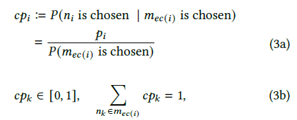
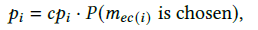
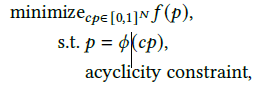
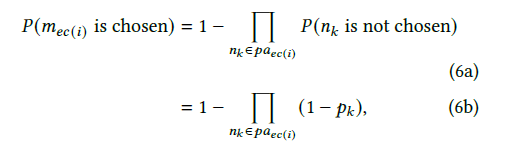
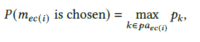
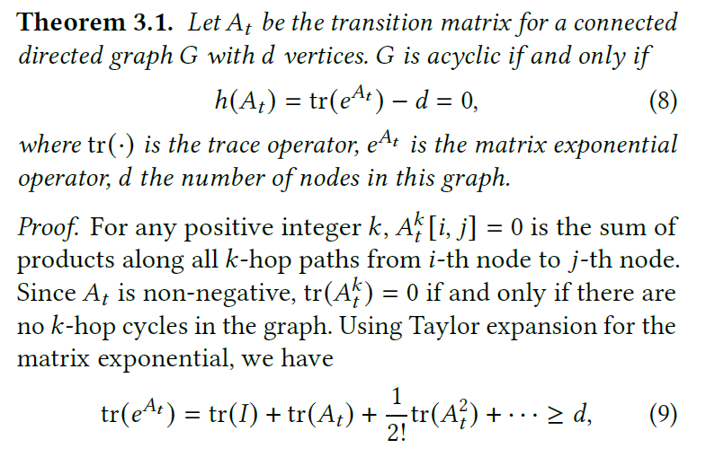

# 1. Motivation
- E-graph is widely used to optimize e-graph extraction, in compiler optimization, theorem proving, program synthesis.
- **E-graph extraction** is critical, since it determines cost-efficiency.

# 2. Past Method 
- Integer Linear Problem (binary pruning) <- Scalability issue
- Heuristic-based <- Suboptimal
They can't be parallelized. (limits scalabilty/quality trade-offs)

## 2.1. Problem 
- E-graph extraction is basically NP-hard problem.
- Previous works cannot break scalabiltiy--quality trade-offs. (MLP, Heuristics, ML-based apporach etc..)
- To find optimal e-graph extraction, we need hw-friendly method, GD.

## 2.2. Remaining Problem 
- to make it Differentiable, binary=>probability relaxation is possible solution,
- however, 
1. structural constraint(completeness condition : one e-node from root class is selected, exactly one e-node from each child e-class should be selected, no cycle) 
2. because of 1., local probability cp is not directly connected to objective function., we need to calculate global probability based on cp, in **differentiable** way.

# 3. Proposed Method 
## 3.1. Probability relaxation
- rather than binary variable s_i in {0, 1}, use p_i=[0,1] to make it differentiable.

## 3.2. Handling completeness conition
- based on local probability cp, compute global probability p, if this is possible, problem reformulated into following.

- Junction Tree algorithm(complexity explode), Loppy belief propagation(approximation, converge in linear time), since we cannot exactly obtain the global probability in practice, (it should be differentiable, and cheap) consider two extreme cases and find the hybrid strategy.
### Independent assumption
- if we assume that parent E-nodes are independently selected, from root node P=1, we can continously, parallely propagate probability.

### Fully correlated 
- if we assume that parent E-nodes are fully correlated, maximum value will be exact probability.

two assumption gives us differentiable, cheap way to calaculate global probability function based on conditional probability(local)

## 3.3. Handling hard constraint(acyclic)
- to reflect acyclic constraint, made a h(t) as a penalty term to remove cycles. 
- overall, optimization problem becomes following equation.

# 4. Implementation

## 4.1. Optimization
optimization targets minimize objective function, by learning cp(conditional probability)

Some optimziation(SpMV) and techniques(SCC decomposition/batched approximation, Seed batching) was applied to improbe overall efficiency.

# 5. Experiment
GD achieves comparable result, much faster, scalability in E-graph extraction problem.

# 6. Conclusion
First differentiable approach to e-graph extraction. 
Looking foward non-linear cost model in realistic/practical situcation 