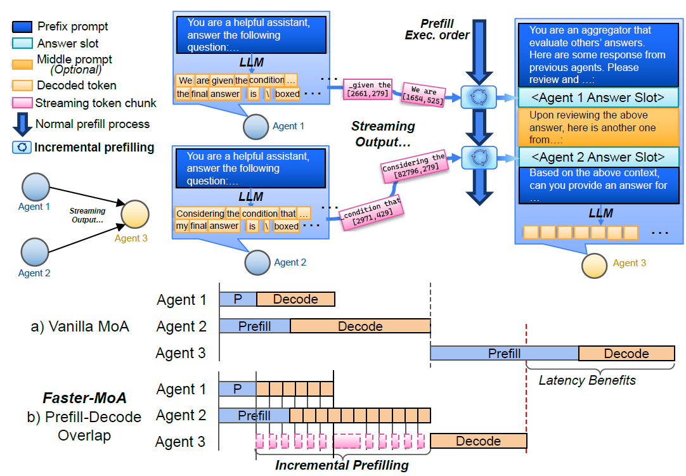

# 1. Motivation
MoA inference

# 2. Past Method 
all-to-all connected MoA serving 

## 2.1. Problem 
- All-to-all message is often redundant (algorithmic redundency)
- Since all-to-all communication results in data dependency which causes low utilization (system inefficiency)
- Overlapping opportunity

=> structed sparsity already had proved to be effective to reduce computational demand while preserving accuracy 

# 3. Proposed Method 
## 3.1. Hierachical tree structure 
- dense connection => tree connection
- reduces prefill length, reduces data dependency, reduce computational complexity, redundancy

## 3.2. Early-stopping 
- IF confidence-weighted similarity average is similar to 0.7, stop.

## 3.3. Incremental prefilling for PD overlapping 
- **PD disaggregation**
### 3.3.1. Expose two API 
: generate, prefill_only(length 0 generation)
### 3.3.2. APC (agent prompt cache)
: during decode step of agent 1, 2 (unit of chunk) => incremenetal prefill of agent 3.
### 3.3.3. Overall flow 
: fetch(identifying dependency) => append(dependent request handling) => incremental-prefill loop(hide prefilling latency)

# 4. Implementation
6 GPU with 2 engines for each Model.

# 5. Experiment

# 6. Conclusion
3 factors collectively improves E2E latency, up to 90%.

# 7. My perspective 
- why 9-3-1? (DSE oppertunity)
- how about exploiting Data-parallel / model-parallelism (systemic optimization opportunity)

