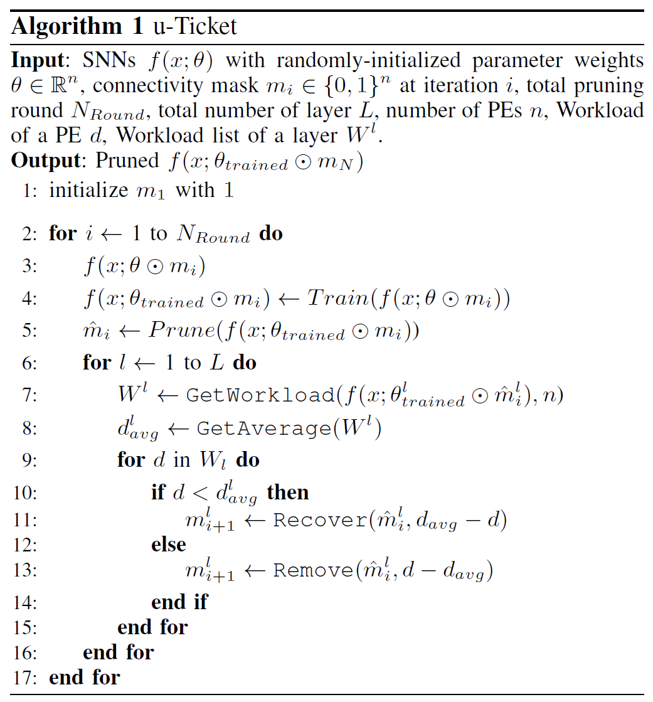
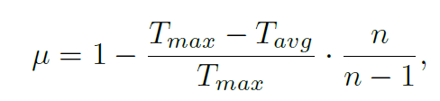

# TL;DR

## Iteratively modifying neuron connection while training the model, It resolves load imbalance problem while preserving sparsity and accuracy.

---

## 1. Problem Context

### 1.1 Main Problem
- Workload Imbalance problem : Large seale SNN is impractical to realize, pruning method is used. But, pruning results in imbanced non-zero density throughout computing unit, it waste power, performance.

### 1.2 Previous Approaches and Their Limitations
- Additional Hardware unit(FIFO, permuting unit) 

## 2. Methodology

### 2.1 Core Idea
#### 2.1.1. LTH based pruning + Random retrival/elimination
LTH(lottery ticket hypothesis) : In randomly initialized neural network, there is 1st award lotto (Great subnetwork which is initialized to specific weight combination that contributes training process). (Experimental hypothesis)

LTH based Pruning : So, if we find this subnetwork weight combination, then we can reach comparable accuracy by training that subnetwork once again.

This paper : **Adjust weight connection (addition / eleimination) in each round** when proceed with LTH based prune-aware training.

#### 2.1.2. Metrics for utilization

Worst case => 0
Best case => 1

### 2.2 How and Why It Works

### 2.3 Implementation Details (When Necessary)

## 3. Results and Discussion

### 3.1 Experimental Setup
#### 3.1.1. SW(dataset)
CIFAR10, Fashion-MNIST, SVHN, CIFAR100

#### 3.1.2. SW(architecture)
VGG-16, ResNet-19 (with pytorch)

### 3.2 Key Results
0 Idle cycles, maximized utilization, with small accuracy degradation

Improved latency, Power consumption while maintaining Sparsity and Accuracy.

### 3.3 Conclusions and Implications
Heuristically modify weight connection while training phase. It is basically from LTH based strategy, but additionally modification process in each round is differing point.
It preserves accuracy while resolving load imbalance problem. 

## 4. My Perspective (Optional)
- 1. Hardware architecture assumption? 
- 2. Neuron mapping(minimizing NoC overhead) is heavy calculation. How simulate? : This paper don't care about interconnect overhead. It only models PE-related power consumption.
- 3. Reason of pruning is only memory usage not computation time? then, using neuron type after clustring (like in truenorth) is insufficient? : Yes, insufficient.
- 4. What is novelty? just smoothing overall workload in flat, ramdomly? : Yes, that is single novelty, but it really solves problem in simple way. 
