# 1. Motivation

In transformer Decoder based model, LLM inference, Inefficient managing KV cache causes two problems : 

## 1.1. Internal/External Memory fragmentation

## 1.2. Not exploit oppertunity for Memory sharing
-> Near zero memory waste + Sharing => Improve Throughput

# 2. Past Method 

## 2.1. Problem 
- In decode stage, memory access is bottleneck
### Solution : Request level batching 

## 2.2. Remaining Problem 
- Request arrive at different times -> delayed 
- Requests may differ input/output legths -> padding (inefficient)
### Solution : Request level batching -> Fine-grained batching mechanisms + Iteration level scheduling

## 2.3 remaining problem
#### 1. Large KV cache
still, number of requests that can be batched together is still constrainted by GPU momory capacity (in particular, KV cache) 
#### 2. **Not adjusted to Complex decoding algorithm**
when using Complex decoding algorithms, there is more, diverse oppertunity to share KV memory. 
(ex. multiple sample -> share KV cache in prompt stage, beam search -> share KV not only prompt, but also decode stage) 
#### 3. **Memory waste**
since Input& output length is not fixed, memory pre-allocaation is highly inefficient. Advanced memory scheduling algorithm required.
- reserved slots for future slot 
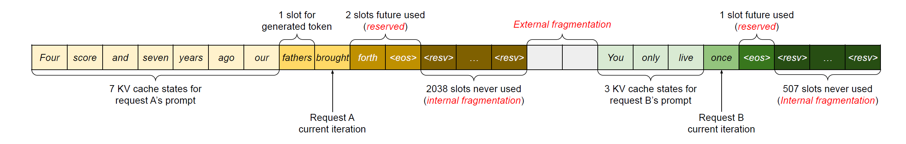
- interanal memory fragmentation due to over-provisioning for potentioal maximum sequence lengths 
- external memory fragmentation due to memory allocator like the buddy allocator 

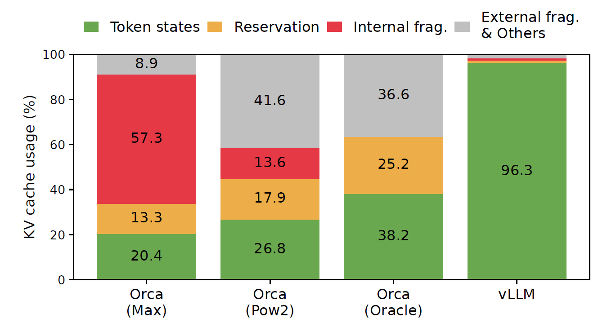
### Solution : Compaction, massive copying of KV cache to prevent internal/external fragmentation

## 2.4 remaining problem
#### 1. Performance issue 
massive KV-cache makes compaction impractical in performance-sensitice environment.
#### 2. can't utilize oppertunity of memory sharing 
pre-allocated chunk space for each request prevents memory sharing specific to decoding algorithm

# 3. Proposed Method 
## 3.1. PagedAttention 
## 3.2. vLLM 

# 4. PagedAttention, vLLM

## 4.1. Idea 

1. Partition KV cache of each sequence into KV blocks, which contains K, V of fixed number tokens. 
2. Store it in non-contiguus memory space 
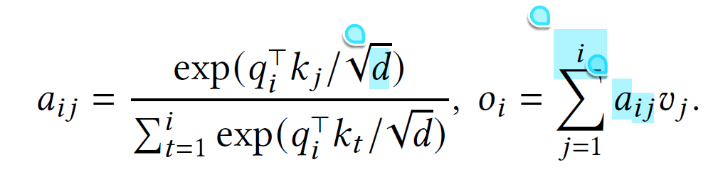 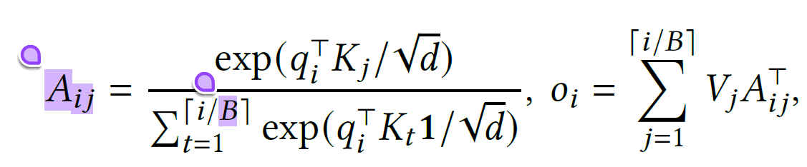

## 4.2. Implementation

### 4.2.1. Overall architecture 
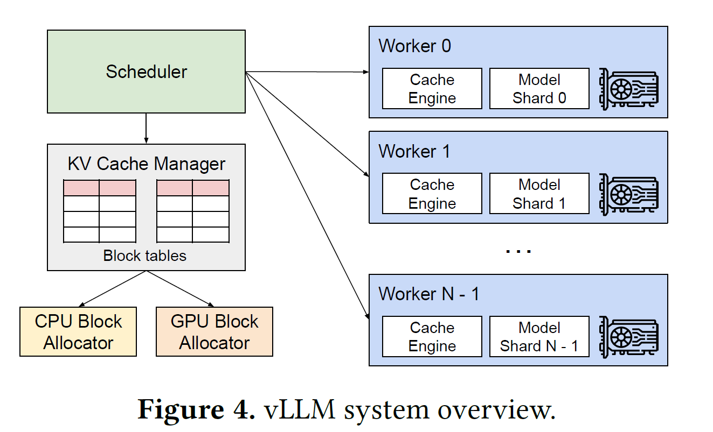
- Central scheduler : Coordinate execution of distributed GPU workers
- KV cache manager : Effectively manage KV cache using paging method 

### 4.2.2. KV cache manager 
- Anologous to the Virtual memory in OS, page correspond to KV-block
- Logical block <-> Physical block mapping make possible on-demand allocation of KV block result in reducing memory waste 
- Maintains block tables (Logical, Physical mapping, contains physical block number, # of filled) 
- Limits all memory waste for a request within one block!, allows more request to fit into memory, result in Improved throughput.

- Example: Greedy decoding with example "Four score and seven years ago our" 
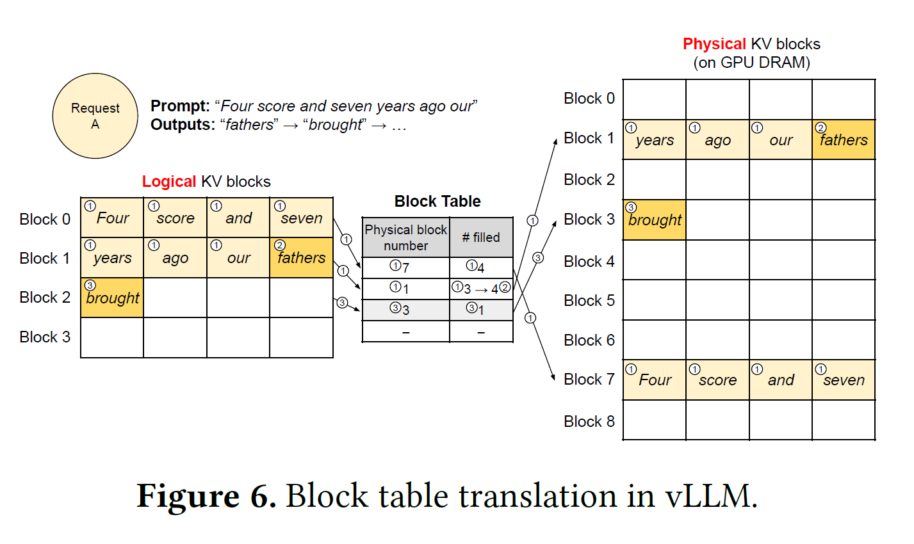
1. In propmpt phase, since input sequence is length 7, Assign 2 logical block and mapping to 2 physical block. After calculation, store KV cache in to physical block(GPU DRAM) 
2. In first decode phase(autoregressive generation), since last block is not fully filled, stored in last block and modify #filled from 3 -> 4 
3. In second decode phase, sice last block is fully filled, assign new logical block, and map it to free physical block, store in new block and append to block table
4. When generation is finished, Physical block can be freed to store KV cache for another request.

### 4.2.3. Memory sharing strategy 
#### - Parallel sampling 
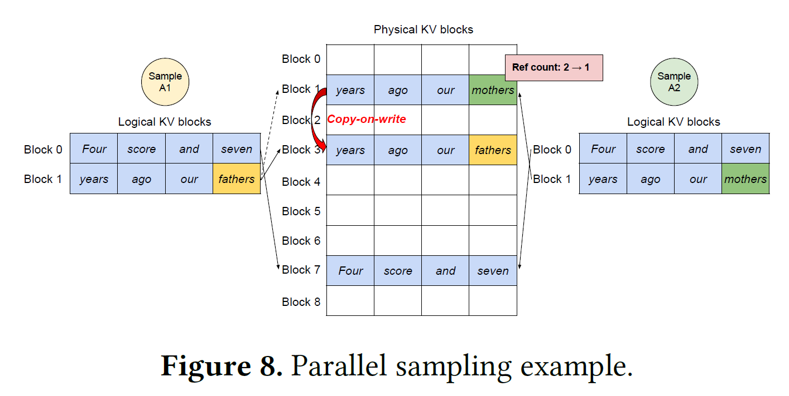
In prompt phase, 
1. Assign reserved space(physical block) for one copy of prompt's state, store KV-cache.
2. Set reference_count (How many logical blocks refer to that physical block?, used for safe freeing, prevent double write) as number of samples. 

In decode phase,
1. If reference_count > 1, sample write KV cache in latest block => assign new physical block, decrease reference_count (CoW), this is for preventing double write  
2. If reference_count >. 1, sample write KV cache in new block => simply assign new physical block. (no CoW)
3. If reference_count == 1, directly write in current/next block.
4. If reference_count == 0, free physical block.

#### - Beam search
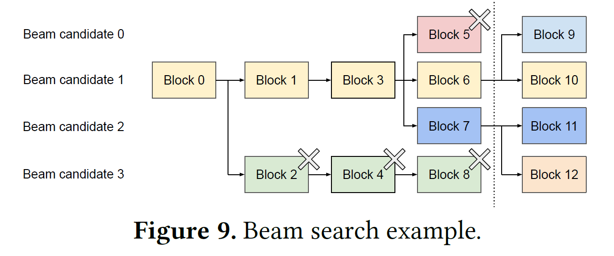
In decode phase, 
1. Find best top k in (k*vocab_size) space. (beam search)
2. If previous candidate not adopted, **Free**: derease reference_count for all used Physical table for that candidate. 
3. If previous candidate is adopted, **Fork**: increase reference_count for all used Physical table for that candidate, with number of new children candidate number.
4. If new candidate makes new KV cache, **Append**: new KV cache, if required, allocate new physical block.

### 4.2.4. Scheduling, Preemption
- Basically, first-come-first-serve (FCFS) for all requests 
- Eviction
1. When eviction is inevitable, predict which block will be accessed furthest in future (Heuristics) 
2. Blocks in sequence, multiple sequence within one request => all or nothing (atomicity) 
- Recovery 
1. CPU RAM swapping 
2. Recomputation

# 5. Implementation

## 5.1. Kernel-level Optimization

1. Fused reshape and block write : split, store KV cache
2. Fusing block read and attention : read, compute KV cache 
3. Fused block copy : CoW mechanism

## 5.2. Supporting various decoding algorithms

Fork, Append, Free used in Beam search can be extended to general decoding algorithms 

# 6. Experiment

## 6.1. Experimental setup

### Model Configuration
OPT 13/66/175B, LLaMA 13B

### Workload 
ShareGPT(user-gen), Alpaca(GPT-gen)
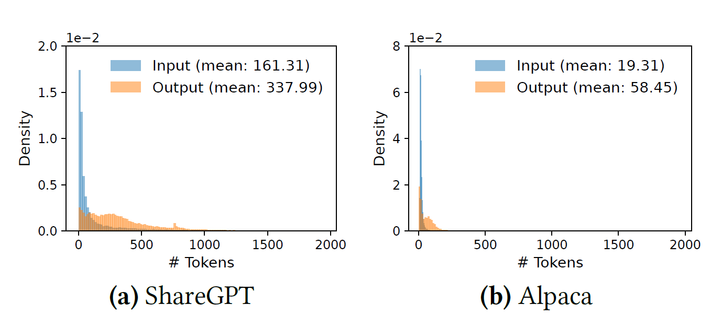

### Baseline 
FasterTransformer + Custom scheduler similar with Triton
Orca (with buddy allocator), with Ideal(Oracle), partial(Pow2), No(Max) knowledge in output seq length

### Key metrics 
Throughput 

## 6.2. Experimental result 

### Significantly improved throughput in Basic sampling
- 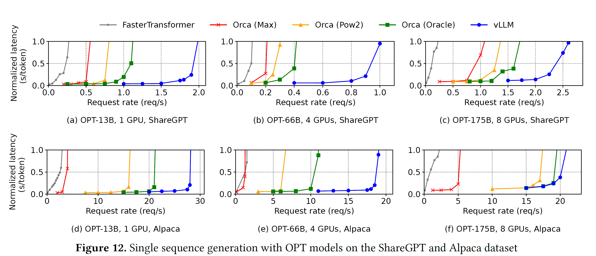
- 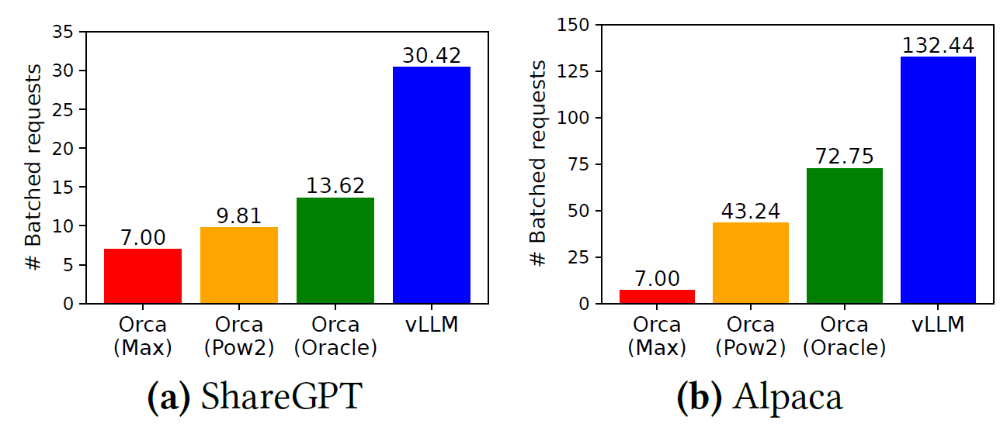
### Significantly improved throughput in Parallel/Beam sampling
- 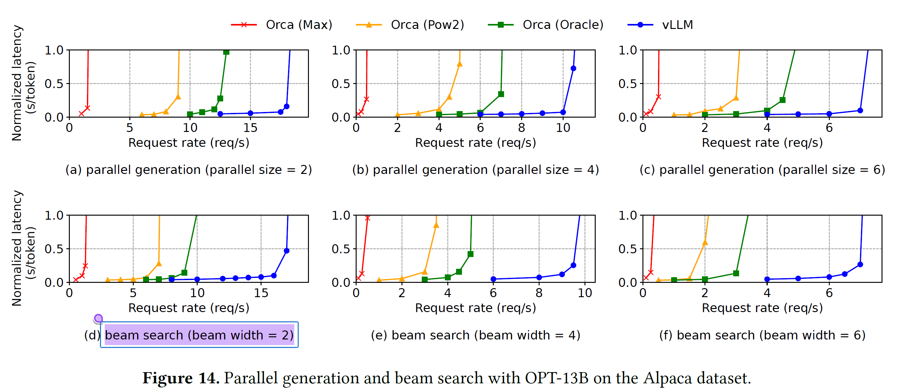
- 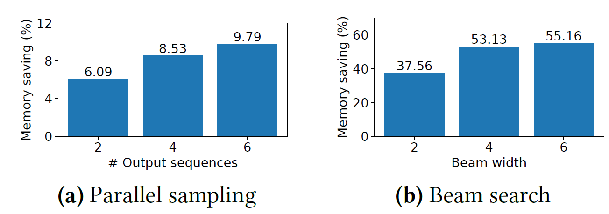
### Significantly improved throughput in special situation (Shared prefix (System prompt), Chatbot)
- 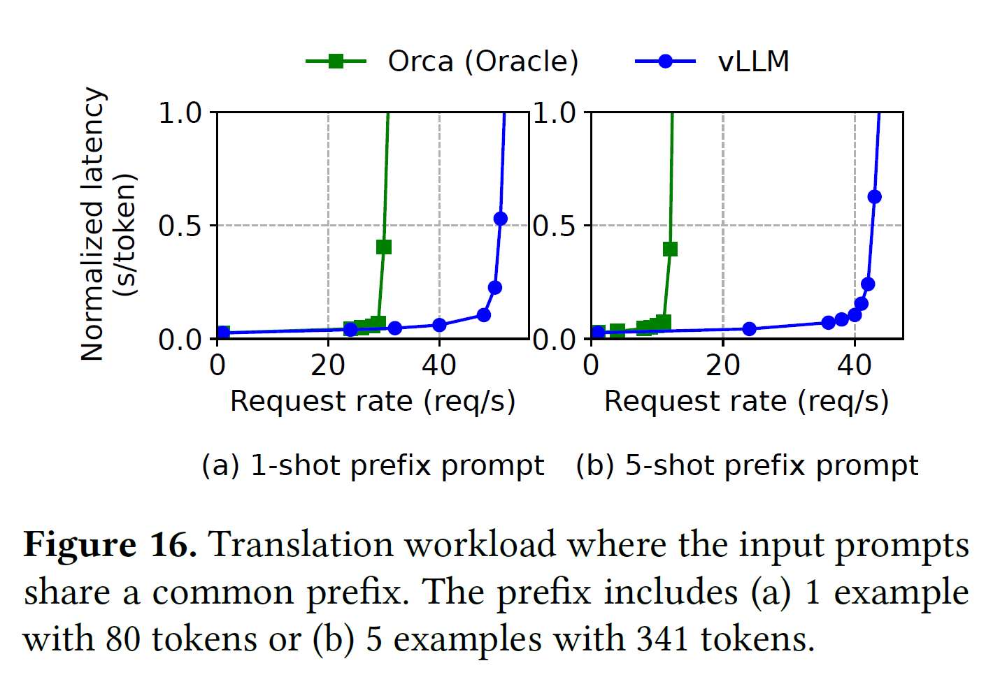
- 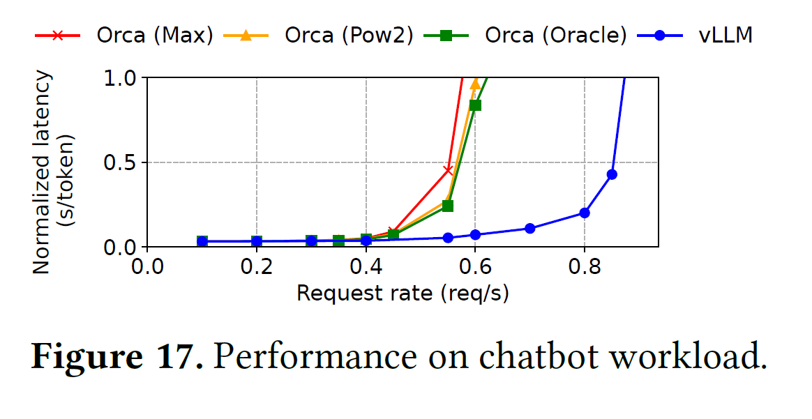

### Optimize memory usage -> Allows more requests to be batched -> Improved throughput

# 7. Ablation studies 

## 7.1. Effect of block size, B

#### If B is too big, 
- memory sharing efficiency : decrease, by CoW mechanism
- Internal fragmentation : increase, memory waste upper bound per request increase
- swapping performance : decrease, cause numerous small data transfer 

#### If B is too small,
- GPU utilization for parallel read/compute : decrease, matrix become more vector-like

### Optimal value found by experiment : 16

# 7. Conclusion

With 
- PagedAttention, new attention algorithm that allocate KV cache in paging,
- vLLM, LLM serving system that efficiently share KV block, schedule user request,

Result in
- Reduced memory waste 
- Catch oppertunity of KV cache sharing

Achieved 
- 2-4X throughput improvements over the SOTA systems
