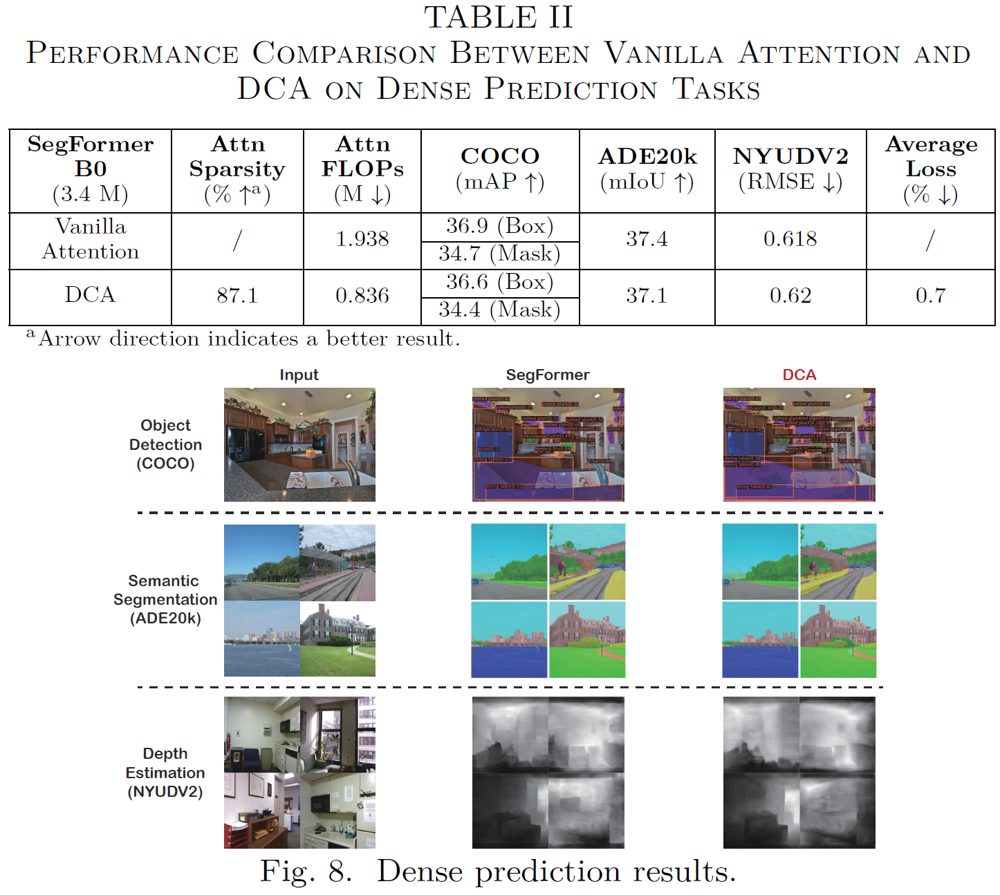

# 1. Motivation 

## 1.1. Computational complexity : O(n^2*h) quadratic complexity of Attention mechanism  
### -> Slow, Resource-intensive property in edge devices.

## 1.2. Pyramid like architecture of modern VIT  (Pyramidal ViT)
### -> Unbalenced workload causes inefficient utilization of hardware

# 2. Past Method 

## 2.1. Software view 

A. Sparse attention  
B. FLASHATTENTION

## 2.2. Hardware view 

A. Compute-in-memory (CIM)

## 2.3. Remaining problem

### A. Sparse attention is still O(n^2*h)
- VIT for Dense prediction has long sequence for transformer input
- memory usage Quadratically increase, off chip access Increase

### B. Pyramidal VIT, unbalanced workload 
- pyramidal structure of ViT encoder

-> First trial to address both of two issues

# 3. Proposed Method 
## Algorithmic level : Decoupled chunk attention
## Architectural level : SRAM-based CIM + RRAM storage 
## Circuit level : Reconfigurable computing circuit

# 4. Algorithmic level : Decoupled chunk attention mechanism

## 4.1. Patch rearrangement
### Main idea 
"Unlike NLP, in image processing, the correlation between adjacency patches is strong!"
-> Sequential flattening not only **scatters adjacant patches**, but also **use unceccesory memory**

### Implementation
1. Divide patch embedding in (H*W) space, into Windows in (H/4*W/4) space 
(그림) 
2. Rearrange patches into sequential flattening 
3. *Attention with patches within the same window* 
-> Result in O(n) Linear correlation with input sequence length n

## 4.2. Hardware-friendly Chunk Attention
### Main idea 
"Since attention is handled independently in chunks, only a portion(C/N) of the weights need to be brought into memory. Also, pipelining can be adopted"

### Implementation
0. Set chunk size which is compatible to SRAM capacity 
1. Partition Q, K, V into chunks. load only required parts
2. Pipelining 

# 5. Architectural level : SRAM-based CIM + RRAM storage, hybrid architecture

## 5.1. Overall architecture 
### Main idea
"Minimize off-chip memory access using RRAM + smart scheduling(SPMF scheduler)"

### Implementation
- Top Controller
- RRAM bank : 4MB, for static weight storage (QKV)
- 16 SRAM CIM (macro supporting bit/element reconfiguration) : Operation unit for MatMul
- Serial and parallel module fusion(SPMF) scheduler
- Global buffer: dynamic weight storage (norm, scale ...)
- Nonlinear unit : deal with nonlinear function

* SRAM CIM (details will be updated) 
: Large size matrix computation -> high-input-parrellism, single bit accumulation 
: Small size matrix computation -> low-input-parallelism, 4 bit multiplication 
-> utilize hardware maximally 

## 5.2. Serial and Parallel Module Fusion Scheduling
### Main Idea
"reconfigurable CIM is for HW flexibility, SPMF scheduler is SW level flexibility" 

### Implementation
- determine optimal parallel/serial workflow
- parallelize, full pipelining of four operations (details will be updated) 
(XWq, XWv -> serial) 
(XWk -> QKT -> AV -> SWp pipelined)

# 7. Experiments 

## 7.1. Model 
backbone: SegFormer-B0 
input: 512*512 pixels -> 128*128 patches 

## 7.2. Experiment 
baseline0 : No optimization
baselline1 : DCA 
op0 : RRAM storage 
op1 : DCA+RRAM storage +SPMF scheduler

Average performance degradation with DCA : 0.7%

# 8. Conclusion 
### With 
1. DCA mechanism with 
2. SRAM reconfigurable CIM
3. RRAM hybrid architecture and 
4. SPMF scheduler, 
### proposed design supports that  
- patch length up to 16384
- with speedup to 18.5×-217.1×
- with reduction in memory accesses of 1.7×-7.4×
- improvement in energy efficiency of 1.8×
- under less than 1% performance loss across three representative pixel-level
tasks.

